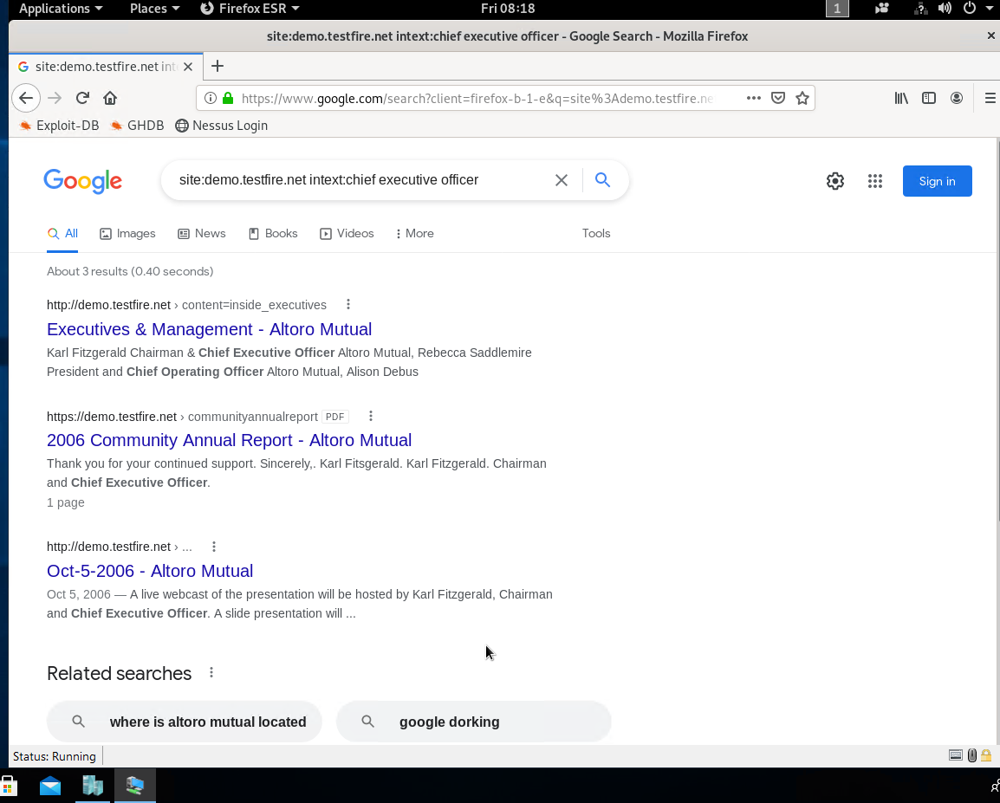
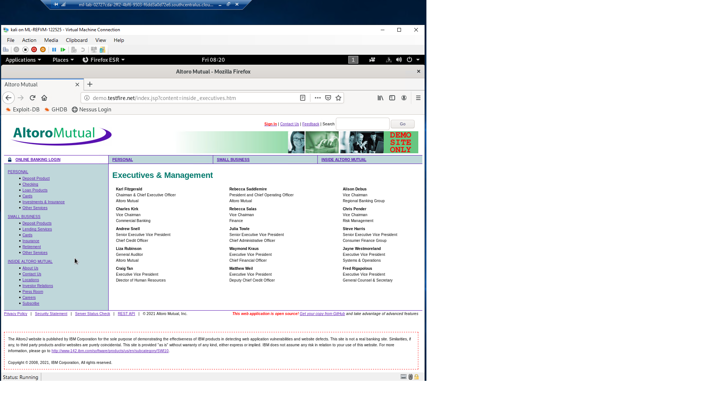
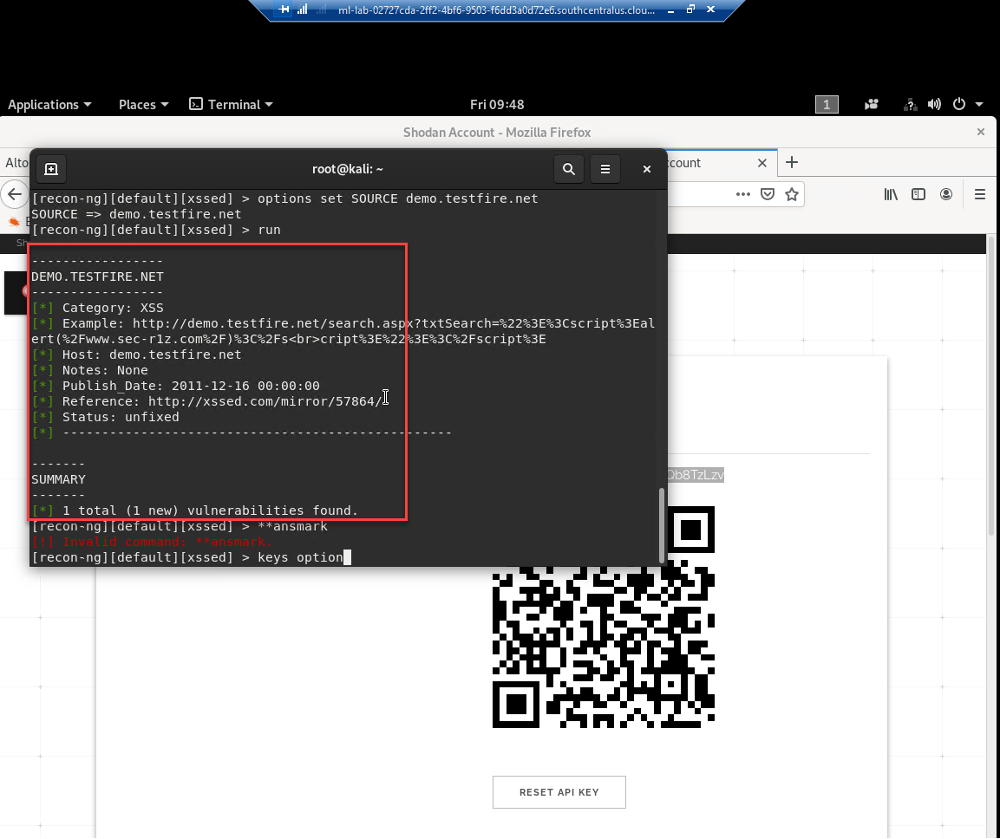

## Week 16 Homework Submission File: Penetration Testing 1

#### Step 1: Google Dorking

- Using Google, can you identify who the Chief Executive Officer of Altoro Mutual is:

**Ans** :- Use the command **site:demo.testfire.net intext:chief executive officer**

- How can this information be helpful to an attacker:

**Ans :-** This information would serve as OSINT and can be used as by an attacker for impersonating attacks.
Also attackers attempt to gain unauthorized access to executive’s accounts as C-level executives are often privy to sensitive information that is highly valued in the darkweb.
Cybercriminals target executives using well thought out and tailored spear phishing messages to trick the executive into divulging passwords and other sensitive information.

#### Step 2: DNS and Domain Discovery

Enter the IP address for `demo.testfire.net` into Domain Dossier and answer the following questions based on the results:

  1. Where is the company located: 

**Ans :- Sunnyvale, CA**
  
2. What is the NetRange IP address:

**Ans : - 65.61.137.64 - 65.61.137.127**
  
3. What is the company they use to store their infrastructure:
 
**Ans :- Rackspace Backbone Engineering**

4. What is the IP address of the DNS server:

**Ans :- 65.61.137.117**

#### Step 3: Shodan

- What open ports and running services did Shodan find:

**Ans :- 80, 443, 8080**

**Running Services - TCP, SSL & HTTPS, HTTP**

#### Step 4: Recon-ng

- Install the Recon module `xssed`. 
- Set the source to `demo.testfire.net`. 
- Run the module. 

**Ans:- commands to be used**

1) recon-ng
2) keys add shodan_api [key to be added]
3) marketplace install xssed
4) modules load recon/domains-vulnerabilities/xssed
5) options set SOURCE demo.testfire.net
6) run

Is Altoro Mutual vulnerable to XSS: 

**Yes, Altoro Mutual is vulnerable to XSS**

### Step 5: Zenmap

Your client has asked that you help identify any vulnerabilities with their file-sharing server. Using the Metasploitable machine to act as your client's server, complete the following:

- Command for Zenmap to run a service scan against the Metasploitable machine: 
 
nmap -sV 198.168.0.10

- Bonus command to output results into a new text file named `zenmapscan.txt`:

nmap -oN zenmapscan.txt -sV 192.168.0.10

- Zenmap vulnerability script command: 

nmap --script samba-vuln-cve-2012-1182 192.168.0.10

- Once you have identified this vulnerability, answer the following questions for your client:
  1. What is the vulnerability:

SMB is a network file sharing protocol that requires an open port on a computer or server to communicate with other systems. SMB ports are generally port numbers 139 and  445.
Port 139 is used by SMB dialects that communicate over NetBIOS. It's a transport layer protocol designed to use in Windows operating systems over a network.
Port 445 is used by newer versions of SMB (after Windows 2000) on top of a TCP stack, allowing SMB to communicate over the Internet. This also means you can use IP addresses in order to use SMB like file sharing.

Thus leaving it exposed to not just own network but to the whole internet

  2. Why is it dangerous:
 
It allows to execute arbitary code on the target machine and also shared resources are available over the entire Internet for reading and deletion, unless configured properly.

  3. What mitigation strategies can you recommendations for the client to protect their server:

Block ports 135-139 in your router/firewall.

Keep your systems up-to-date 

Using VPN

